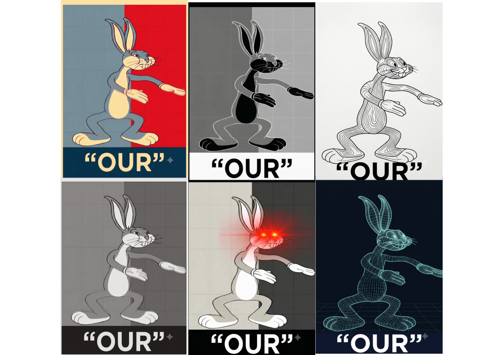

# OCWS: Our C-Written Shell

OCWS is a high-performance, purely C-native Wayland desktop environment built on top of `labwc` (an Openbox-inspired compositor), `sfwbar` (a GTK3-native statusbar engine), and `fuzzel` (a Wayland-native launcher).

By strictly adhering to a C and GTK foundation, OCWS delivers an ultra-premium, heavily translucent "glassmorphic" aesthetic with absolute zero JavaScript, Electron, or Qt runtime overhead.

## Architecture

OCWS is not merely a theme; it is a modular platform built on four distinct layers:

1. The Core Display Stack (The Engines)
   - labwc: The core Wayland compositor.
   - sfwbar: The GTK3 UI engine rendering the shell.
   - fuzzel: The application launcher.
   - gtk-layer-shell: Anchors the shell to Wayland outputs.

2. The OCWS Event Bus (Standardized IPC)
   - Background processes do not interact with the UI directly. Instead, they communicate via the OCWS Event Bus using the `ocws-emit` tool.
   - Example: `ocws-emit System.Volume 50` updates the UI instantly.
   - Supported Namespaces: System.Volume, System.Brightness, System.Battery, System.Cpu, System.Memory, Network.WiFi, Media.Title, etc.

3. The Plugin Autoloader
   - OCWS supports drag-and-drop extensibility.
   - When the shell boots, the `ocws-plugin-loader` scans `~/.config/ocws/plugins/`. Any `.widget` files found are dynamically injected into the running configuration without requiring manual text edits.

4. Essential Desktop Subsystems
   - Wallpaper: swaybg
   - Notifications: mako or dunst
   - Authentication: polkit-gnome
   - Locking/Idle: swaylock and swayidle

## Codebase Structure

The repository is organized to clearly separate the platform's core from its configurations:

- dotfiles/ocws/
  The heart of the shell. Contains `ocws.config` (the main layout), `ocws-control-center.widget` (the unified popup), and `ocws-daemon.sh` (the background event listener).
- dotfiles/ocws/plugins/
  The drop-in directory for third-party extensions and custom widgets.
- dotfiles/labwc/
  The compositor configurations, including `autostart` which bootstraps the OCWS daemon and shell.
- scripts/
  Automation and IPC tools, notably `ocws-emit` and the `theme-engine` script.

## Installation

OCWS is designed to run on minimal base systems (such as Arch Linux or Void Linux).

### 1. Install System Dependencies
Ensure you have the core packages installed. For example, on Arch Linux:
`sudo pacman -S labwc sfwbar fuzzel gtk-layer-shell pipewire wireplumber libpulse brightnessctl inotify-tools playerctl bc swaybg wl-clipboard cliphist mako polkit-gnome swayidle swaylock grim slurp`

*Note: If your distribution has outdated packages, you can compile the absolute latest versions directly from Git by running `./build-ocws-core.sh all`.*

### 2. Run the Installer
Clone this repository and run the setup script:
`./install.sh`

The installer will deploy the OCWS namespace to `~/.config/ocws/`, configure `labwc`, and link the necessary IPC scripts to your local bin path.

## Documentation

For further information on configuring and extending OCWS, please refer to the following documentation:

- docs/getting-started.md: A guide to the default keybindings, layouts, and using the Control Center.
- docs/configuration.md: Detailed instructions on using the OCWS Event Bus, writing custom plugins, and modifying the glassmorphic CSS theme.
